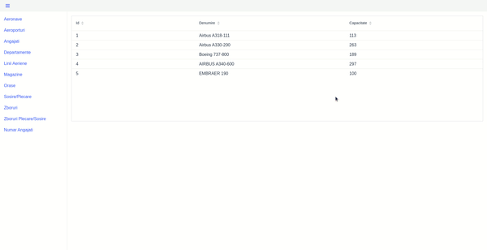

# Airport management system

A web application for managing an airport network: airports, cities, airlines, aircraft,
flights, arrivals and departures, departments, employees and airport shops. Built for the
*Databases* course at the University of Bucharest.



- One page per table with a searchable grid and an edit form (create, update, delete)
- Report views: departures and arrivals per flight, number of employees per department
- Relational data model (nine related tables) mapped with JPA / Hibernate

## Stack

Java 11, Spring Boot 2.3, Spring Data JPA, Vaadin 14 (server-side Java UI), MySQL.

```
src/main/java/.../backend/models         JPA entities (Aeroport, Zbor, Aeronava, Angajat, ...)
src/main/java/.../backend/repositories   Spring Data repositories
src/main/java/.../backend/service        business logic
src/main/java/.../frontend               Vaadin views and forms
```

## Running

Needs a MySQL server with a database called `airport_db`
(connection settings in `src/main/resources/application.properties`; the host can be set with
`MYSQL_HOST`). Tables are created on first start.

```bash
./mvnw spring-boot:run      # then open http://localhost:8080
```
